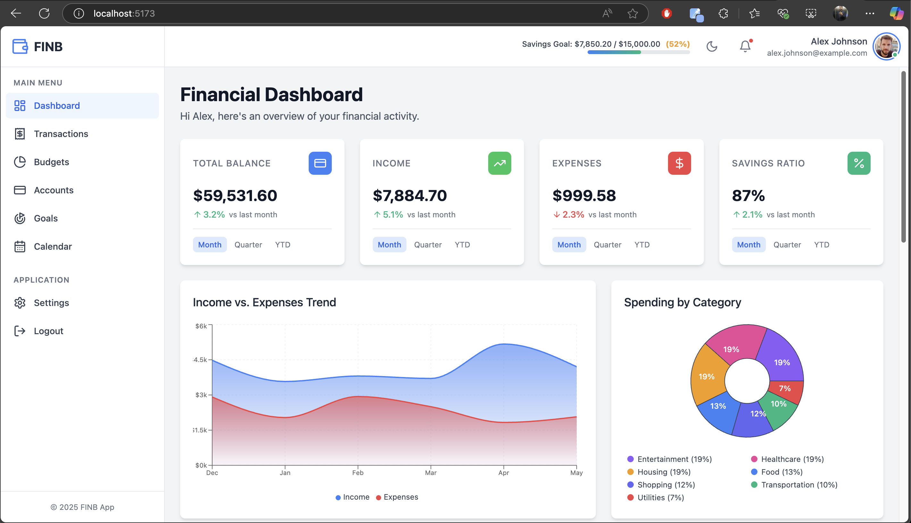
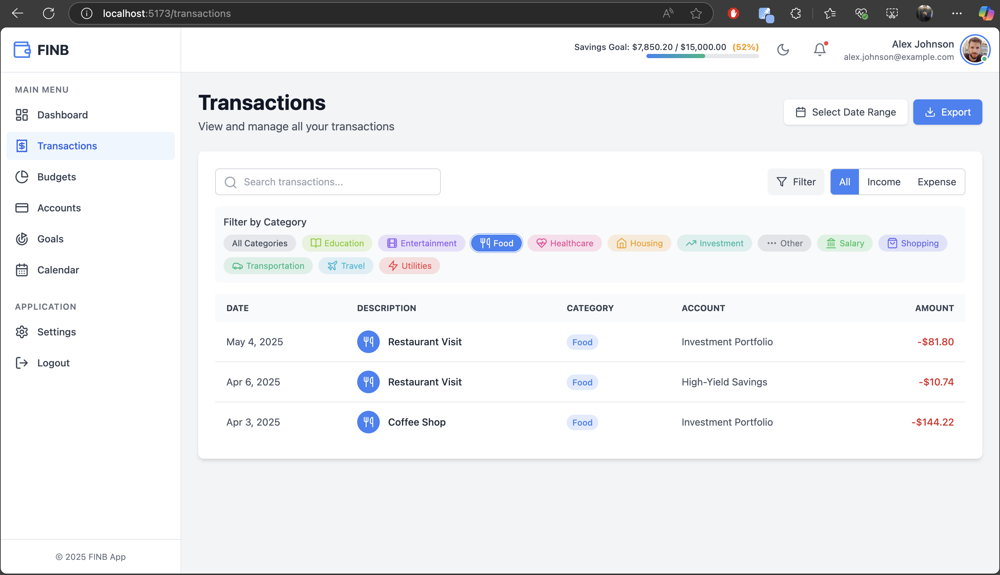
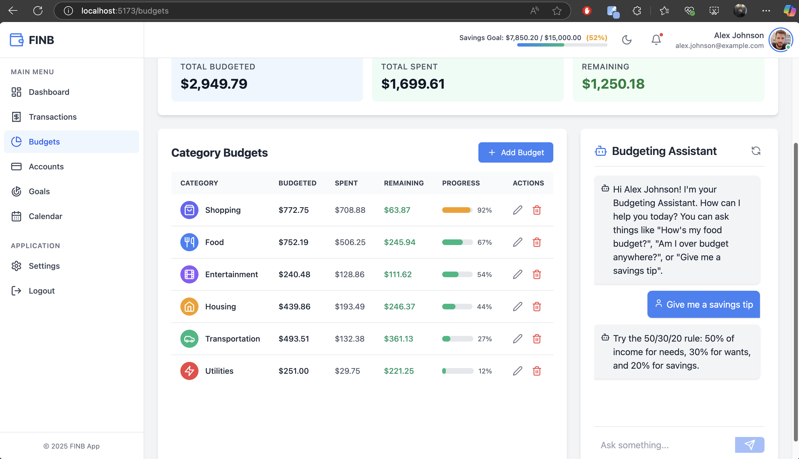
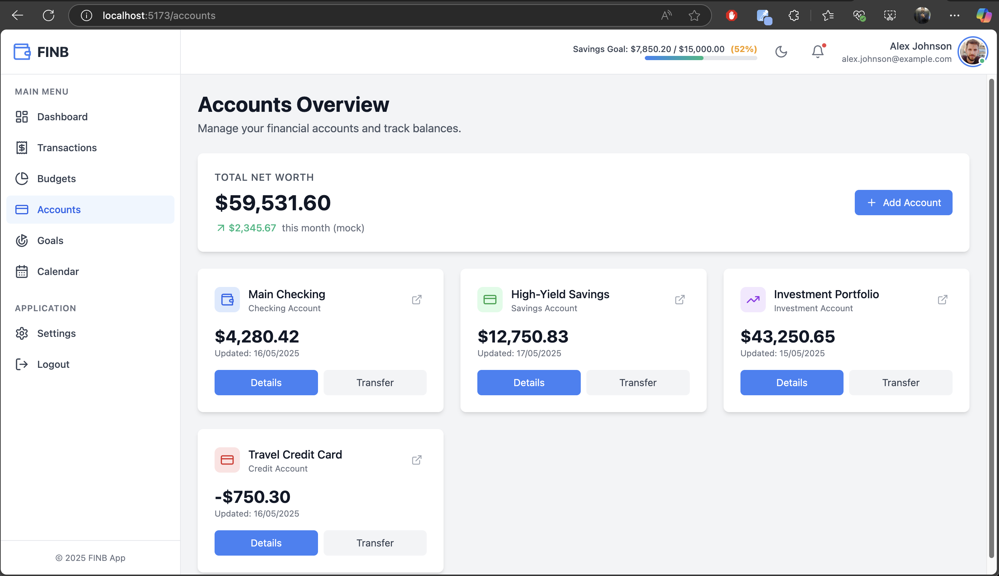
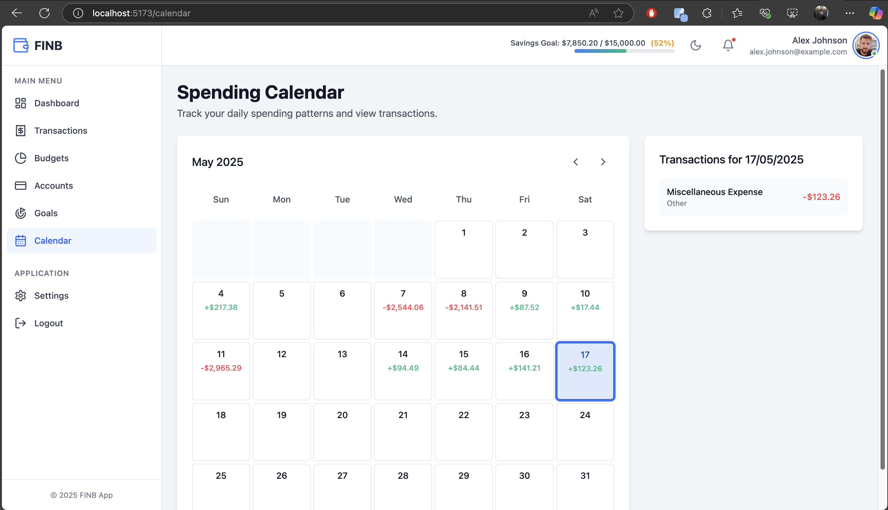
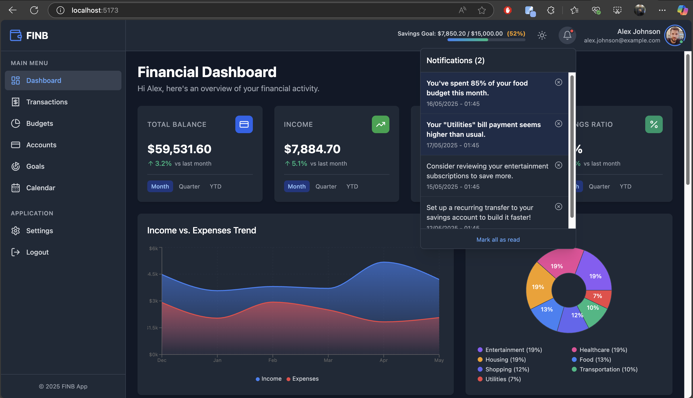

# FINB - Personal Finance Dashboard

FINB is a React-based web application designed to help users track their finances, manage budgets, set savings goals, and gain insights into their spending habits. It features a responsive design, dark mode, and various interactive components for a comprehensive financial overview ,`Project Under Task of Finb Company as Frontend developer role`

## Features Checklist & Status

1. **Header & Profile Section**

   * [X]  Personalized greeting with user name and avatar
   * [X]  Monthly savings goal status bar
2. **Financial Overview Cards**

   * [X]  Total Account Balance
   * [X]  Monthly Income
   * [X]  Monthly Expenses
   * [X]  Savings Ratio (Calculated as `(Income - Expenses) / Income * 100`)
   * [X]  Cards support view toggling for: Monthly, Quarterly, Year-to-date
3. **Charts**

   * [X]  Expense vs Income Chart (Area chart)
   * [X]  Category-Wise Spending Pie Chart
     * [X]  Segments highlight on hover/click to show details (True subcategory drill-down not implemented due to data structure complexity, current implementation shows detail for main category)
     * [X]  Color-coded category legends
4. **Recent Transactions Table**

   * [X]  Shows latest transactions (Dashboard shows a snippet; full Transactions page has full list with pagination)
   * [X]  Includes: Date, Description, Type (indicated by +/- and color), Category, Amount
   * [X]  Color-coded (green for income, red for expenses)
   * [X]  Filter and search options (Full functionality on Transactions page; basic on Dashboard snippet)
5. **Calendar-based Tracker**

   * [X]  Monthly calendar showing daily spending/net activity
   * [X]  Clickable day to view transactions for that day
6. **Notifications & Tips**

   * [X]  Smart alerts (mocked data)
   * [X]  Budget tips & insights (mocked data)
7. **Budgeting Assistant**

   * [X]  Chatbot interface for budget-related queries and tips
   * [X]  Can discuss monthly budgets by category (data sourced from Budgets page)
   * [X]  Budgets page shows visual indicators of budget usage (progress bars)
8. **Additional Features**

   * [X]  Responsive Design for various screen sizes (Mobile, Tablet, Desktop)
   * [X]  Dark Mode toggle with persistence in localStorage
   * [X]  Settings Page: Mock profile updates, appearance (dark mode), notification preferences (mock), currency selection (mock).
   * [X]  Modular component structure
   * [X]  Uses `lucide-react` for icons
   * [X]  Uses `recharts` for charting

## Demo

Live Demo - [https://inter-task-lemon.vercel.app/](https://https://inter-task-lemon.vercel.app/)

Video Demo - [https://drive.google.com/drive/folders/18gdmARV8ObsxIXDsohgLMGuit5vDJhvL?usp=sharing](https://https://drive.google.com/drive/folders/18gdmARV8ObsxIXDsohgLMGuit5vDJhvL?usp=sharing)


|  |  |  |
| ------------------------------------------------- | ------------------------------------------------- | - |
|  |  |  |
|  |  |  |

## Tech Stack

* **Frontend:** React, TypeScript
* **Routing:** React Router DOM
* **Styling:** Tailwind CSS
* **Icons:** Lucide React
* **Charts:** Recharts
* **Build Tool:** Vite

## Project Structure

```
FINB/
├── public/
│ └── ... (static assets)
├── src/
│ ├── assets/
│ │ └── ... (images, etc. - if any)
│ ├── components/
│ │ ├── budgets/
│ │ │ └── BudgetingAssistant.tsx
│ │ ├── dashboard/
│ │ │ ├── BudgetProgress.tsx
│ │ │ ├── ExpenseIncomeChart.tsx
│ │ │ ├── FinancialCard.tsx
│ │ │ ├── NotificationCard.tsx
│ │ │ ├── SpendingPieChart.tsx
│ │ │ └── TransactionsTable.tsx
│ │ └── layout/
│ │ ├── AppLayout.tsx
│ │ ├── Header.tsx
│ │ └── Sidebar.tsx
│ ├── data/
│ │ └── mockData.ts
│ ├── pages/
│ │ ├── Accounts.tsx
│ │ ├── Budgets.tsx
│ │ ├── Calendar.tsx
│ │ ├── Dashboard.tsx
│ │ ├── Goals.tsx
│ │ ├── Settings.tsx
│ │ └── Transactions.tsx
│ ├── types/
│ │ └── index.ts
│ ├── App.tsx
│ ├── index.css
│ ├── main.tsx
│ └── vite-env.d.ts
├── eslint.config.js
├── .gitignore
├── index.html
├── package.json
├── package-lock.json
├── vite.config.js
├── postcss.config.js
├── README.md
├── tailwind.app.json
├── tailwind.config.js
└── tsconfig.json
└── tsconfig.node.json
```

## Setup and Running the Project

1. **Clone the repository (if applicable) or ensure all provided files are in the correct structure.**
2. **Install dependencies:**
   Open your terminal in the project root directory and run:

   ```bash
   npm install
   # or
   yarn install
   ```

   This will install React, React Router, Lucide Icons, Recharts, Tailwind CSS, and other necessary development dependencies.
3. **Configure Tailwind CSS (if not already set up):**
   Ensure you have `tailwind.config.js` and `postcss.config.js` set up. Your main CSS file (`src/index.css` or similar) should include Tailwind directives:

   ```css
   @tailwind base;
   @tailwind components;
   @tailwind utilities;
   ```

   If you want to use the `scrollbar-thin` utilities, you might need the `tailwind-scrollbar` plugin:

   ```bash
   npm install -D tailwind-scrollbar
   # or
   yarn add -D tailwind-scrollbar
   ```

   Then add it to your `tailwind.config.js` plugins:

   ```javascript
   // tailwind.config.js
   module.exports = {
     // ... other configs
     plugins: [
       require('tailwind-scrollbar'),
     ],
   }
   ```
4. **Run the development server:**

   ```bash
   npm run dev
   # or
   yarn dev
   ```

   This will typically start the application on `http://localhost:5173` (for Vite) or `http://localhost:3000` (for Create React App).
5. **Open the application:**
   Open your web browser and navigate to the URL provided in the terminal.

## Time Spent

* **Initial Scaffolding & Core Pages (Previous Iterations):** ~5 hours (This includes setting up routing, basic layout, initial components for dashboard, transactions, budgets, etc.)
* **Implementing Settings Page & Budgeting Assistant Bot:** ~1 hours (Includes creating new components, logic for bot responses, UI for settings, and context integration)
* **Responsive Design Enhancements & Refinements:** ~1 hours (Iterating through components, testing on different screen sizes, adjusting Tailwind classes)
* **Adding Savings Ratio Card & Dashboard Tweaks:** ~1 hour
* **Review, README, and Finalization:** ~50 min
* Deployment : ~1 min

**Total Estimated Time (for the entire application):** Approximately 7-9 hours.

## Assumptions

1. **Data Source:** All data is mocked via `src/data/mockData.ts`. No backend API integration was required.
2. **Authentication:** No authentication system was implemented. The application uses a single mock user.
3. **State Management:** Primarily using React's built-in state (`useState`, `useEffect`) and context (`Outlet`'s context for dark mode). For a larger application, a dedicated state management library (like Zustand, Redux Toolkit) might be considered.
4. **Styling:** Tailwind CSS is the primary styling solution. Custom CSS is minimal.
5. **Iconography:** `lucide-react` is the chosen icon library.
6. **Charting Library:** `recharts` is used for data visualization.
7. **"Drill-down" in Pie Chart:** The request for "clickable segments to drill down into subcategories" was interpreted as providing more detail for the *selected main category* upon interaction (hover/click), rather than navigating to a new view of sub-categories. Implementing true sub-category drill-down would require a more hierarchical data structure and significant changes to chart logic.
8. **Functionality of "Export", "Select Date Range" (Transactions Page), "Add Goal/Budget/Account":** These buttons are present for UI completeness but their full functionality (e.g., actual data export, date filtering logic, modal forms for adding items) is not implemented beyond the UI element itself.
9. **Budgeting Assistant Complexity:** The assistant provides simple, rule-based responses. A more advanced AI/NLP-driven assistant is outside the current scope.
10. **Settings Page Persistence:** Profile updates on the Settings page are mock and do not persist beyond the session or reflect in `mockData.ts` globally (except for the `currentUser` state within the component). Dark mode preference *is* persisted using `localStorage`.

## Design & Architectural Decisions

1. **Component-Based Architecture:** The application is broken down into reusable components for pages, layout elements, and specific UI sections (e.g., `FinancialCard`, `TransactionsTable`).
2. **Layout Structure:** A common `AppLayout` component manages the `Sidebar` and `Header`, with page content rendered via `<Outlet />` from React Router.
3. **Routing:** `react-router-dom` is used for client-side navigation.
4. **State Management for Dark Mode:** Dark mode state is managed in `AppLayout` and passed down via Outlet context to the `Settings` page. It's also persisted to `localStorage`.
5. **Mock Data:** All data is centralized in `mockData.ts`, making it easy to understand the data structure and modify for testing. Helper functions within this file also provide aggregated data (e.g., `getTotalBalance`).
6. **Responsiveness:** Tailwind CSS's responsive prefixes (`sm:`, `md:`, `lg:`) are used extensively to adapt the layout and styling for different screen sizes. Flexbox and Grid are primary tools for layout.
7. **Styling Consistency:** Efforts were made to maintain a consistent look and feel using Tailwind's utility classes and a predefined color palette (primary, success, error, warning colors).
8. **Modularity of Dashboard Cards:** `FinancialCard` is a reusable component, allowing different metrics to be displayed with a consistent UI.
9. **Budgeting Assistant UI:** A chat-like interface was chosen for the `BudgetingAssistant` for a familiar user experience.
